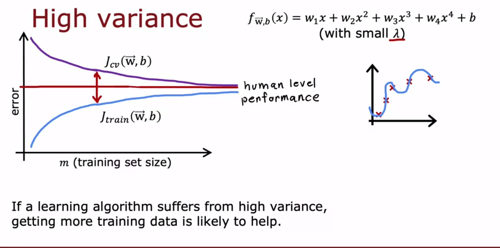
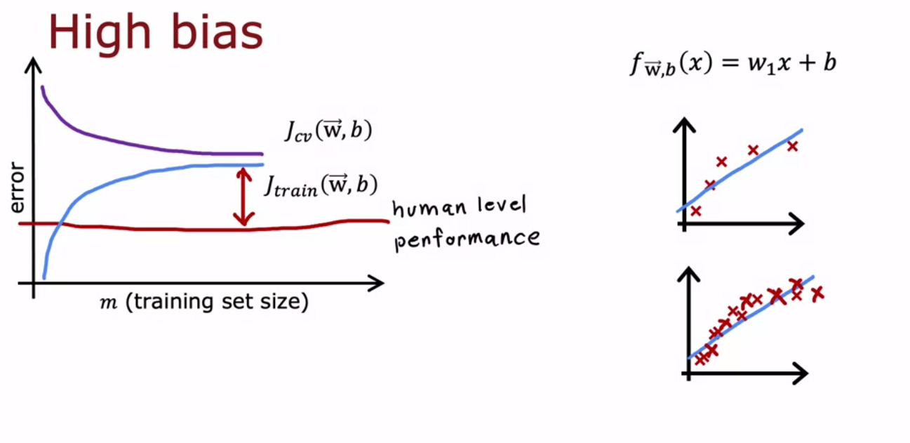
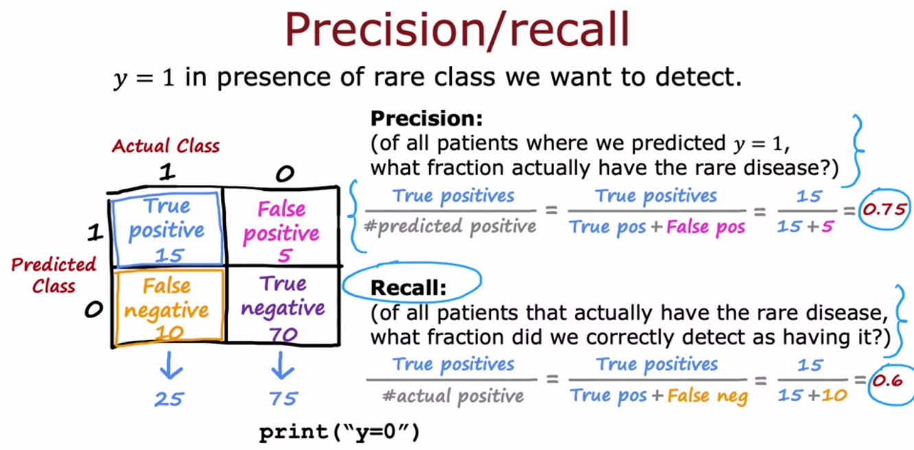

## Testing your Neural Network

### Cross Validation

- Cross validation is a way to test your neural network on data that it has not seen before.

You train your neural network on a training set, just as normal, but maybe your configuration of neurons wasn't the best possible, so you run several configurations of neurons through a cross validation set to find the best configuration.

Since you trained the model both on the test, and cross validation sets, you can't use the cross validation set to test the accuracy of your model. You need to use a third set, the test set.

This test set is used to test the accuracy of your model after you've tweaked the parameters using the cross validation set.

## High variance and bias

With high variance, the cross validation error will always be extremely high because you are overfitting, but actually adding more data will help bring the CV error down, as your linear regression system is required to fit more data.

With high bias, the cross validation error will be high, and adding more data will not help bring the CV error down, as your linear regression system is not complex enough to fit the data.

### Error analysis

Take a subset of the mislabeled data and try to figure out what went wrong. Usually look throught the cross validation set and see what the most common errors are. When you can see patterns of what went wrong with the algorithm, you can then go back and tweak the algorithm to fix that specific problem.

### Fix with more data (Data augmentation)

**Augmented data should have the same label as the original data.**

You might take an image, and warp it. Or take a voice, and add a random background noise.

### Synthetic data

This is the act of making artiificial data, not transformed data. So for instance in OCR, you can use a computer generated font and screenshot it, not necessarily needing to take a real image.

## How to deal with skewed data

### Precision and Recall

When for instance you are predicting a very rare disease. It is often really easy to see how well your algorithm is doing by looking at the percent of correct predictions. For instance a disease that only occurs in 0.1% of the population, if you predict that no one has the disease, you will be correct 99.9% of the time. This is obviously not a good algorithm.

So instead of looking at the percent of correct predictions, you can look at the percent of correct positive predictions. This is called precision.

There is often a tradeoff between precision and recall. We as programmers have to choose where to put our cuttoff for positive and negative classification.

So for instance in this disease case, we will want a very high recall, to be able to get a lot of patients who might have the disease even if we misclassify some healthy people. As it is always good to be precautionary. But maybe if you are a company following leads, you want much more precision because it costs a lot of money to follow up on a client.

The combination of the two scores can be seen in an F1 score.

𝐹1 = 2 ⋅ 𝑝𝑟𝑒𝑐⋅𝑟𝑒𝑐 / 𝑝𝑟𝑒𝑐+𝑟𝑒𝑐

Which is 2 times the harmonic mean of precision and recall. Balancing the two scores.
