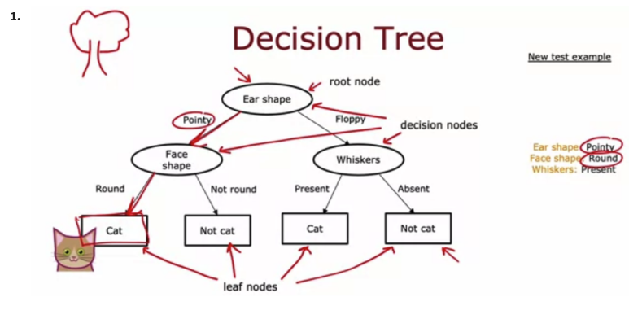
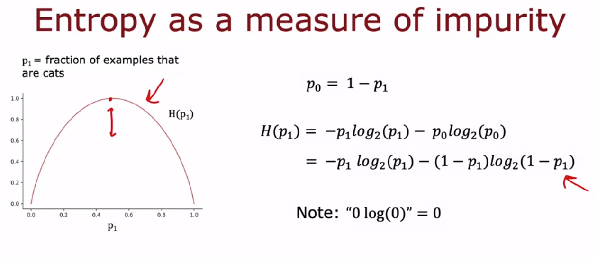
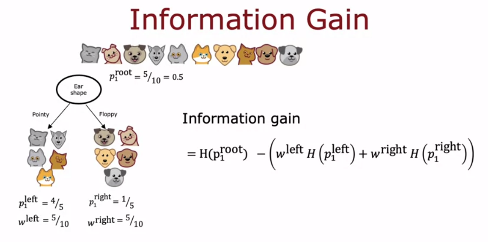
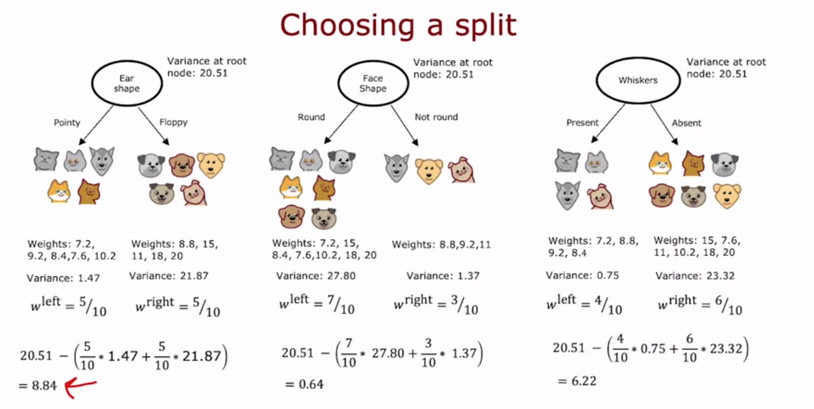

## Decision Trees

### 1. What is a decision tree?

Decision trees are just a way to ask feature per feature if it is absent or present in an example and go down the tree until you get a classification.

### 2. How to build a decision tree?

You want to train the descision tree by seeing which category splits the classification into the cleanest peices. So if you split by eye shape, you will get very clean splits on a race identification, but if you split by hair color, you will get very messy splits.

### How to measure the quality of a split? (purity)

You use an entropy function, the more clean the split is, the lower the entropy is. P0 is the probability of a positive classification, and P1 is the probability of a negative classification.

### Multiple categories and continuous features

For multiple categories, such as a cat having, floppy, straight, or round ears, you can use one hot encoding to split the categories into multiple binary features.

For continuous features, such as height, you can use a threshold to split the feature into two binary features, asking which threshold gets the bigggest Information Gain, and use that to see if its higher than other features.

### Regression trees

Regression trees are the same as classification trees, but instead of using entropy, you use the a reduction in variance, or how wide the continuous truth value (prediction) is.

You want to make a split with the least amount of variance in both sets.

## Ensemble of Trees

* Why do we need ensemble of trees?
    * The problem with trees, is that if we change one learning example, it could change the entire tree. So we want to use an ensemble of trees to make a more robust model, that will allow us to add more data.

* Sample with replacement: A statistical sampling that will randomly sample, but replace it so you can choose it again.

* Generate multiple trees, using a random subset with replacement of the data, and a random subset of the features.