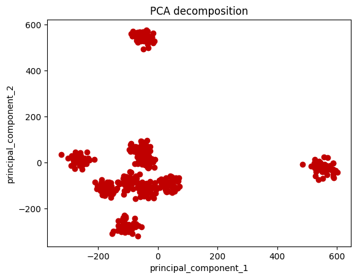

## Recommender System

### Notation

n_u: number of users
n_m: number of movies
r(i,j): 1 if user j has rated movie i, 0 otherwise
y(i,j): rating given by user j to movie i (defined only if r(i,j)=1)
x(i): feature vector of movie i
m(j): how many movies user j has rated

The weights and biases are different for each user, so we index them with.
Each user has a different linear regression model to predict the ratings.

### Cost Function

**For a single user**
The cost function for recommender systems is essentially the same with one main differences, we only have a truth value y, for movies the user has actually rated. So we sum for all i as long as r(i,j)=1 and we divide by the number of movies the specific user has rated. Similarly the normalization term is also different, we sum over all features but we divide by the number of movies the user has rated.

**Note**: you can also completely get rid of the m(j) term since it is a constant and it will not affect the minimization of the cost function.

**For all users**
The cost function for all users is the sum of the cost function for each user. The regularization term is the same as before.

## What happens if you don't have features?

This can happen if you don't have time to label each video by how funny or action-filled it is. In this case, you can use the collaborative filtering algorithm. This algorithm will learn the features on its own.

It is now learning and updating the features each step of gradient descent. We now have a new cost function.
**NOTE**: We are regularizing the x terms.

## Collaborative Filtering Algorithm

Combines both the user-based and item-based approaches. It is a way of automatically learning both the user preferences and item features at the same time.

Update the x and theta terms simultaneously.

### Notation summary

### Collaborative Filtering summary

- Not a neural network
- But a bunch of linear regression models
- What are the weights and biases for a specific user, so we can predict the ratings for that user.
- What are the features for a specific movie, so we can predict the ratings for that movie for all users.

* The combined cost function looks at all the users and all the movie features, and how the specific users rated the specific movies.
* You need to regularize both the featuers of the movies and the weights (preferences) of the users as you are learning both at the same time.

## Content Based Filtering

### Differences and when to use

- **Collaborative filtering** will assign similar ratings to you as people who have similar tastes to you.
- **_Content based filtering_** will assign similar ratings to you as movies that are similar to the ones you like.

- **Collaborative filtering** is good when you have a lot of users and not a lot of movies. And you don't really know anything about the movies.
- **Content based filtering** is good when you know a lot about the movies and users, actual features like age, gender, location, and an actual rating of a movie, reviews and its genre.

### Content based algorithm

Instead of our regular w\*x + b, we now have two feature vectors on the user and the movie. That is X_u and X_m, now to predict the rating we take the dot product of these two vectors. But wait they are different sizes...

### How to learn V_u and V_m from X_u and X_m

We will use a neural network to get our V_u and V_m. We will use the same X_u and X_m as input to each of their own neural networks. The output of the neural network will be V_u and V_m. Then they will be the same size and we can take the dot product of them for the prediction. Note you can also just use a sigmoid activation function after the dot product to get a rating between 0 and 1. If the user will like the movie or not.

### How to train V_u and V_m NN

So these two NNs are linked, their performance is shared. Hence the cost function requires both to run before moving on.

The "truth" value is the actual rating given by the user. The prediction is the dot product of the two vectors.

We have to regularization terms for v_u and v_m NNs. That is add a regularization term for the weights and biases of the NNs.

**WOW we just trained two NNs together, that is unique to NNs.**

**NOTE**: This training is kind of insane, as you need to train on all the movies and users at the same time. So you need a lot of compute power, there are ways to reduce the number of movies you train on, but that isn't covered here.

## Finding related movies

### Collaborative filtering

In collaborative filtering we learn the features of the movies and users. So we can find similar movies by looking at the features of the movies. We can find similar users by looking at the features of the users. And reducing the squared distance between them.

### Content based filtering

Here we actually already know the features of the movies and users, but we go through a NN, to parse out the most important features. So we can reduce the square norm of the difference between the two outputs of different movies.

### Content based filtering feasaibility on large datasets

Our problem is that each time a user logs on it needs to be inference on each movie i, now what if we have 100 thousand movies. That is a lot of compute-power.

So we don't inference on all the movies but rather we perform a retrieval step to greatly reduce the number of movies we inference on.

The way to get these greatly reduced number of movies is up to the programmer but here are some ideas:

- Find similar movies to the recently watched movies by the user.
- Movies from users favorite genre.
- Top movies from the past year (In specific country).

**This is called Retrieval and Ranking**

**Now we have a much smaller set of movies to train on!!**

**Extra optimization**: If you have precomputed the vector of each movie, you can just look up the vector of the movie and not have to inference on it.

### Example implementation

TODO: understand excercise 2 and onwards.

## PCA (data visualization)

### Motivation

- PCA is a way to convert multidimensional data into 2D or 3D data so we can visualize it and perform basic human analysis.

### PCA algorithm

- We want to reduce the dimension of our data from n-dimensions to k-dimensions.
- We want to find a k-dimensional subspace onto which to project our data so as to minimize the projection error.
- We want the projection to be linear.

### PCA algorithm

We use dot products of some unit vector u and the data point x to project the data point onto the z axis. We want to find the unit vector u that minimizes the projection error so that we are as true to the original data as possible.

### Plot data, the more dimensions you have the more variance is kept.

We get only 15% variation

We get 20% variation
